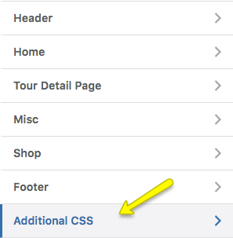

## Modify Theme Styles ##

There are various options available to modify styles in this theme.

1. Go to **Customzier > Additional** CSS and add styles there.

    
    
2. If you want to add styles in theme CSS file, it is recommended that you use child theme's **child-custom.css** file.

    

3. If you do not want to use child theme, then use **custom.css** in parent theme.

    

## Translate The Theme ##

This theme is fully translation ready. For theme translation to your language please consult our Knowledge Base article on [How to translate your theme to your language](https://support.inspirythemes.com/knowledgebase/how-to-translate-your-theme-to-your-language/).

## Hire Customization Services ##

If you need any additional features or want to have modifications in existing theme features then you can contact our theme [customization services team](https://inspirythemes.com/theme-customization/).

