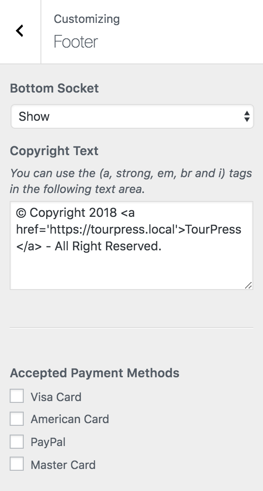

## Footer Settings

To edit **Footer** settings simply navigate to **Dashboard &rarr; Appearance &rarr; Customize** and look for **Footer** section. It gives you the following options:

- **Bottom Socket**
- **Copyright Text**
- **Accepted Payment Methods**

