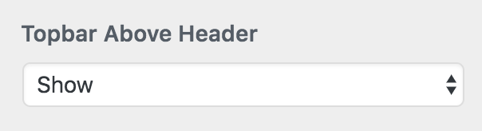
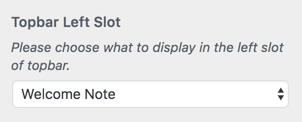
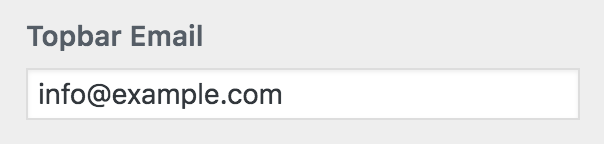
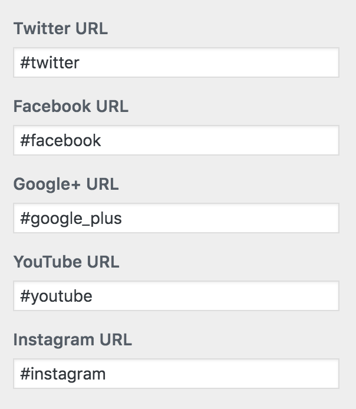
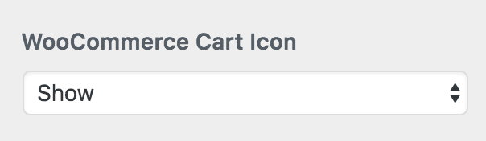

**Topbar Settings** are located in **Dashboard &rarr; Appearance &rarr; Customize &rarr; Header** and click on **Topbar**. In this section you will find the following settings.

- **Topbar Above Header**
- **Topbar Left Slot**
- **Welcome Note Text**
- **Topbar Email**
- **Social Icon URLs**
- **WooCommerce Cart Icon**

## Topbar Above Header

This option allows you to display the topbar on your website. So, you can choose **Show** or **Hide** accordingly.

## Topbar Left Slot

This option lets you choose a welcome note or a short menu for the left area in the topbar section.

## Welcome Note Text

In this text field you can add a short welcome note if you have selected Welcome Note for **Topbar Left Slot** option.

## Topbar Email

You can add an email here to display right before the social icons.

## Social Icon URLs

This entire section will let you add your social media links like facebook, twitter etc.

## WooCommerce Cart Icon

If you have installed WooCommerce then this option let you choose to display or hide the cart icon.

