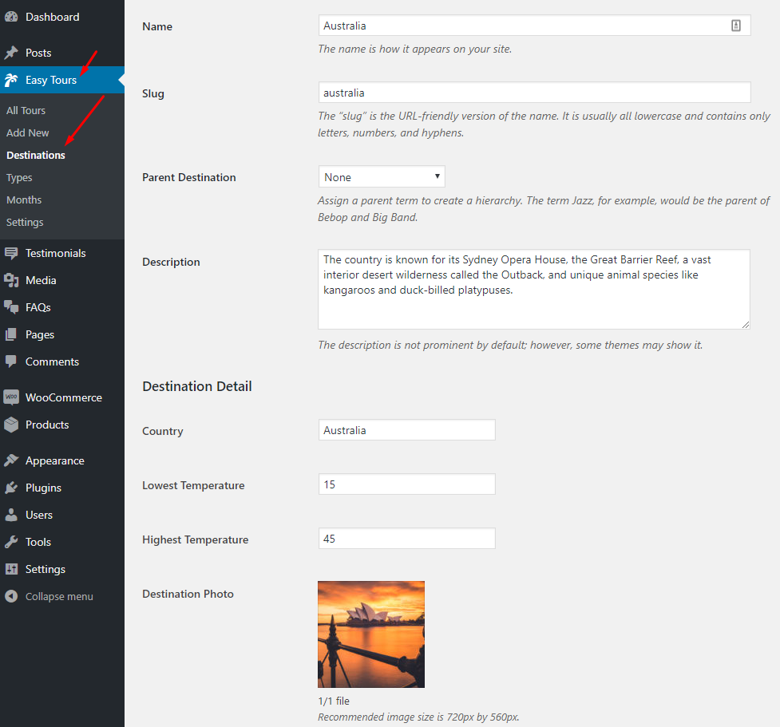
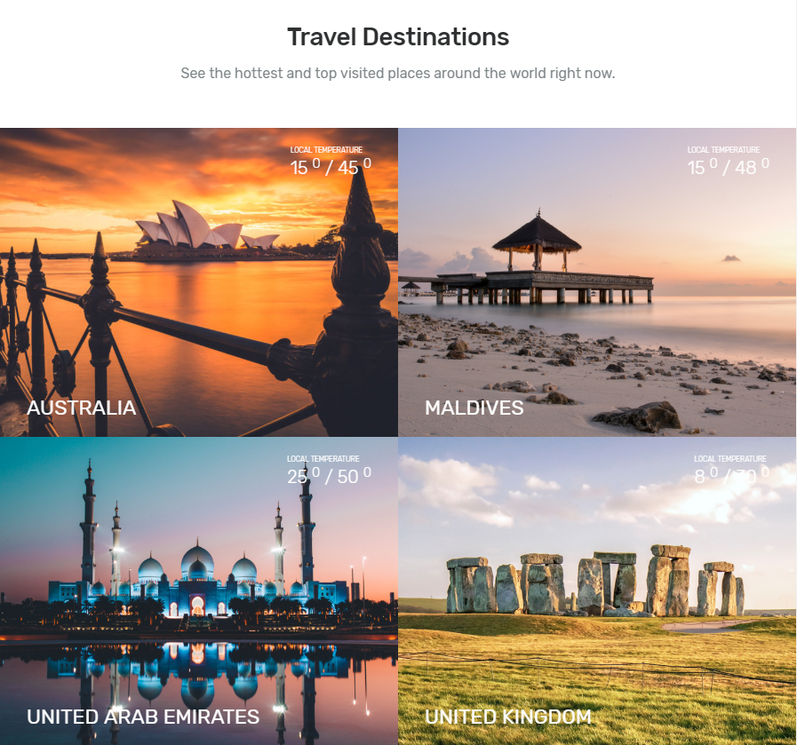

## **Travel Destinations Settings**

If you want to display **Travel Destinations** on homepage then navigate to **Dashboard > Customize > Home > Travel Destinations**. You can choose title description and number of Popular Destinations as shown below.

These Destinations are coming from Easy Tour **Destinations Taxonomy**. You can configure destinations as shown below

It will look like the below image on home page front-end

