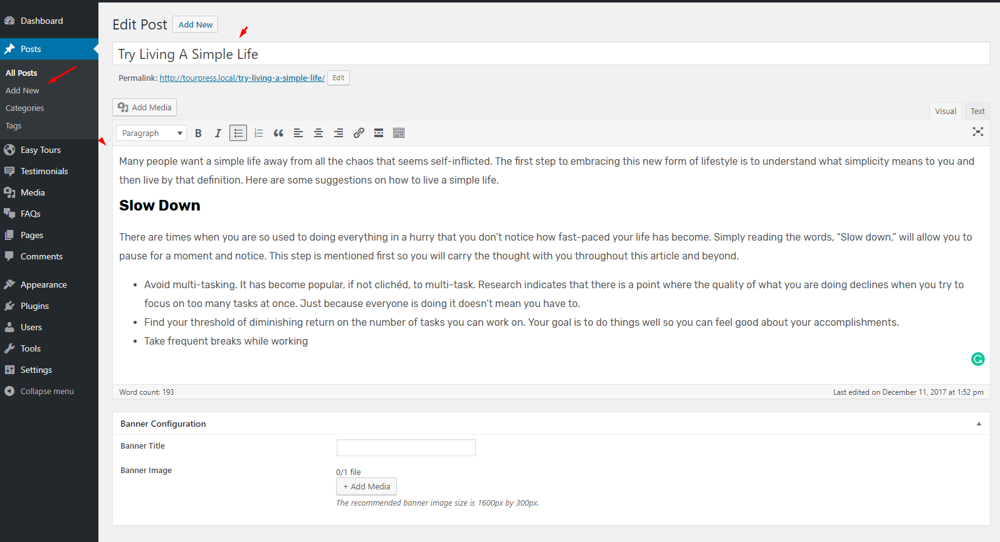
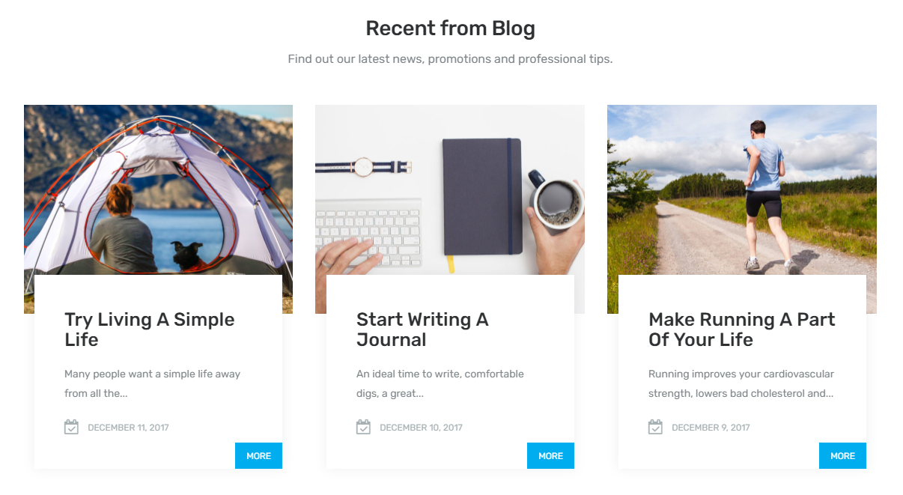

## **Homepage Blog Posts Settings**

If you want to display **Homepage Blog Posts** on homepage then navigate to **Dashboard &rarr; Customize &rarr; Home &rarr; Blog**. You can choose title, description, number of blog posts and blog posts from of recent from blog section as shown below.

These posts are coming from **Blog Posts**. You can add blog posts as shown below

It will look like the below image on home page front-end

