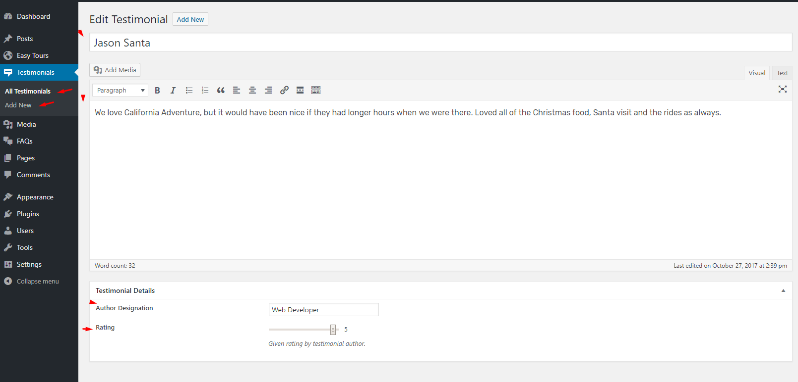

## **Homepage Testimonials Settings**

If you want to display **Homepage Testimonials** on homepage then navigate to **Dashboard > Customize > Home > Testimonials**. You can choose title, description and number of testimonials posts of testimonials section as shown below.

These posts are coming from **Testimonials Posts**. You can add testimonials posts as shown below

It will look like the below image on home page front-end

