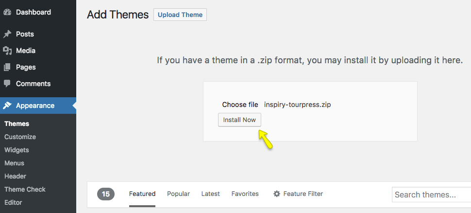
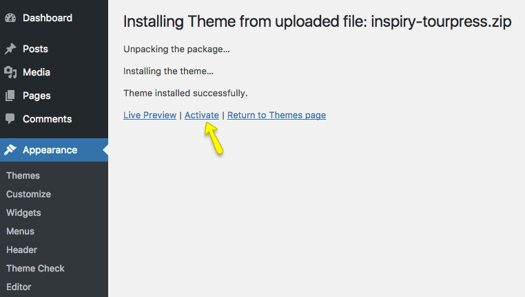
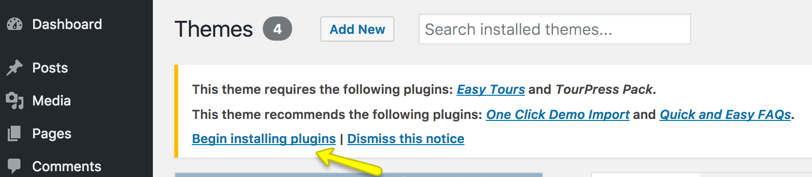
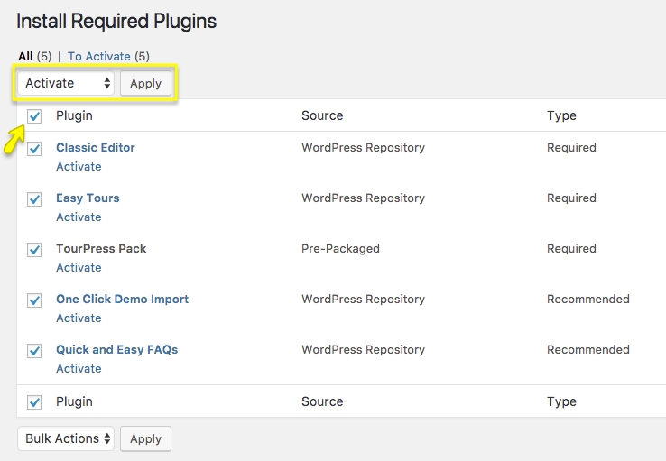

## Installing Theme
To start you must have a working version of WordPress. Almost all major web hosts provides one click WordPress install and you can consult your host's help site for more information in this regard. For manual install you can consult WordPress Codex [Installing WordPress](https://codex.wordpress.org/Installing_WordPress).

Once you have a working version of WordPress, You need to download [All Files and Documentation](img/all-files.png) from themeforest [download page](https://themeforest.net/downloads) and extract the downloaded zip and look for the **inspiry-tourpress.zip**.

## Installing Theme Via WordPress Dashboard
1.  Go to **Dashboard &rarr; Appearance &rarr; Themes** section
2.  Click **Add New**

    
    
3. Select the **Upload Theme** option

    
    
4. Choose the **inspiry-tourpress.zip** file and press **Install Now**

    
    
5. Once the theme is uploaded you need to **Activate** it.

    
    
6. After Activation of theme. Next Step is Plugins Installation

!!! info ""
    if you face any problem during upload through dashboard, please upload the theme using FTP as guided below.
    
## Install Theme Via FTP ( Alternative Way )
1. Access your hosting server using an ftp client like [FileZilla](https://filezilla-project.org/)
2. Go to the **wp-content/themes** folder of your WordPress installation
3. Extract the **inspiry-tourpress.zip** file and put the **inspiry-tourpress** folder in **wp-content/themes/** folder
4. Go to **WordPress Dashboard &rarr; Appearance &rarr; Themes** page to activate the theme

## Install Child Theme

It is highly recommended to use the [child theme](https://codex.wordpress.org/Child_Themes) over your parent theme for any kind of modification in the theme files so that you can easily update parent theme whenever a new update becomes available. A pre-built ready to use child theme is included in the main theme pack that you have downloaded from ThemeForest.

To install child theme, you need to upload the **inspiry-tourpress-child.zip** and activate it in the same way as you uploaded and activated the parent theme's **inspiry-tourpress.zip**.

## Install Plugins
After you have installed and activated the theme, there'll be a list of **required** and **recommended** plugins at the top of the WordPress dashboard.
 
1. Click on **Begin Installing Plugins**

    
    
2. Install **required** and **recommended** plugins

    
    
3. Click Return to **Required Plugins Installer** when plugins installation is completed.
4. **Activate** the Installed Plugins.

    
    
!!! warning ""
    It is important to skip **WooCommerce wizard** in order to work with **One Click Demo** properly.
    
 
