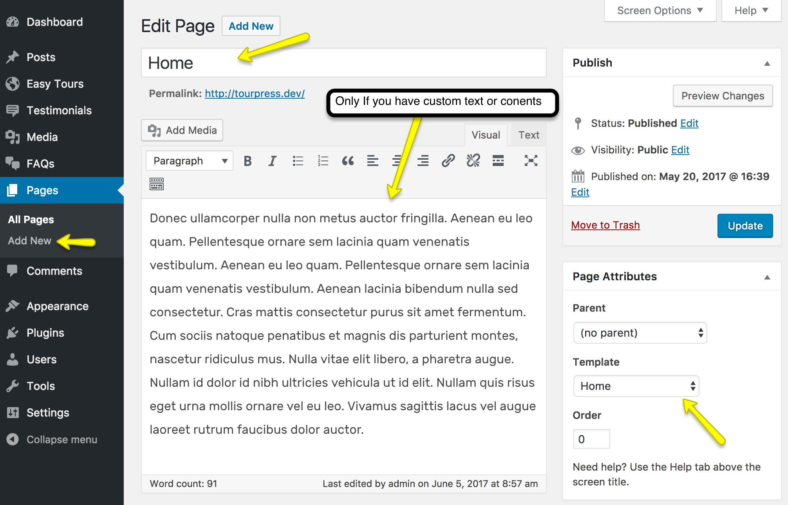
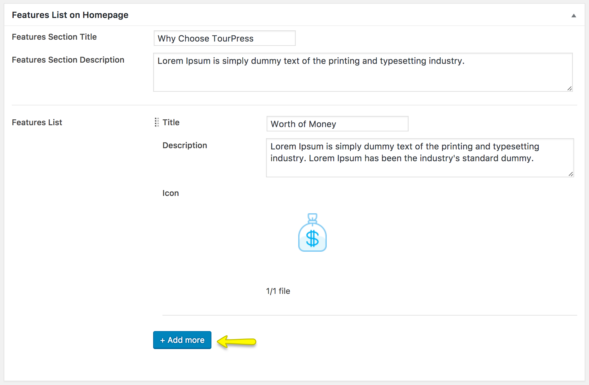

!!! info ""
    If you have imported the **Demo Contents** already then initial pages are already created and you do not need to create them again.
    
You can create a new page from **Pages > Add New** page.

You can see a Banner Configuration metabox area for every page where you can set a banner image and a custom title to display on it as displayed in the screenshot given below.

## Home Page
You can give a title **Home** to this page and select **Home** template then click the **Publish** button.

You will also see a **Features List on Homepage** metabox where you can add homepage features list. See the following image.

## Blog Page
You can give a title **Blog/News** to this page and select **Default Template** template then click the **Publish** button.

After that consult Basic Setup > Configure Read Settings in this documentation to configure it as Posts Page.

## Tours Listing Page