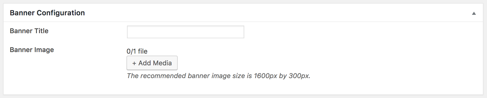

!!! info ""
    If you have imported the **Demo Contents** already then initial pages are already created and you do not need to create them again.
    
You can create a new page from **Pages > Add New** page.

You can see a Banner Configuration metabox area for every page where you can set a banner image and a custom title to display on it as you can see in the screenshot given below.

## Blog Page
You can give a title **Blog/News** to this page and select **Default Template** template then click the **Publish** button.

## Contact Page
You can give a title **Contact** to this page and select **Contact** template then click the **Publish** button.

You will also see a **Contact Information** metabox with multiple tabs where you can configure the whole contact page settings as displayed in the following screenshot.

## FAQs Page

!!! warning ""
    Make sure the **Quick and Easy FAQs** plugin is already installed and activated on your site according to the [Install Plugins](installation.md#install-plugins) section.

You can give a title **FAQs** to this page and select **Default Template** or **FullWidth** template. Use a FAQs listing *shortcode* to list FAQs then click the **Publish** button as displayed in the following screenshot.

You can see the details and all available shortcodes on the **Quick and EASY FAQs** plugin's [detail page](https://wordpress.org/plugins/quick-and-easy-faqs/).