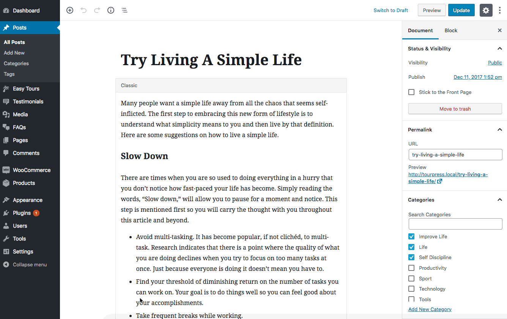

## Add Blog Posts
You can create a new post from **Posts &rarr; Add New** page.

Add the post title, content, categories, tags and set a featured image *(recommended size 750x300)* then click the **Publish** button. As, you can see in the following screenshots.

**Gutenberg/Block Editor**

**Classic Editor**

You can see a **Banner Configuration** metabox area for every post where you can set a banner image and a custom title to display on it as displayed in the screenshot given below.

