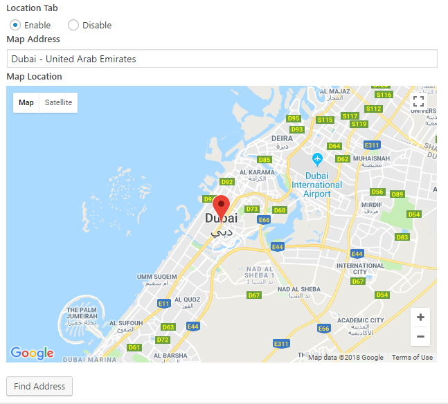
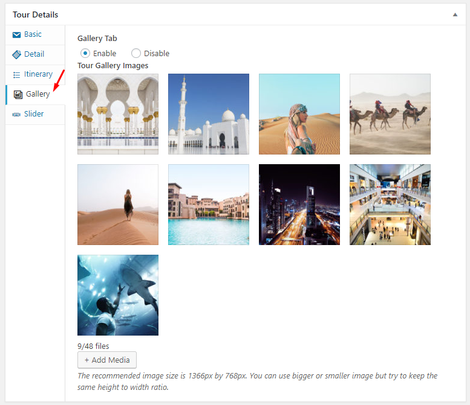
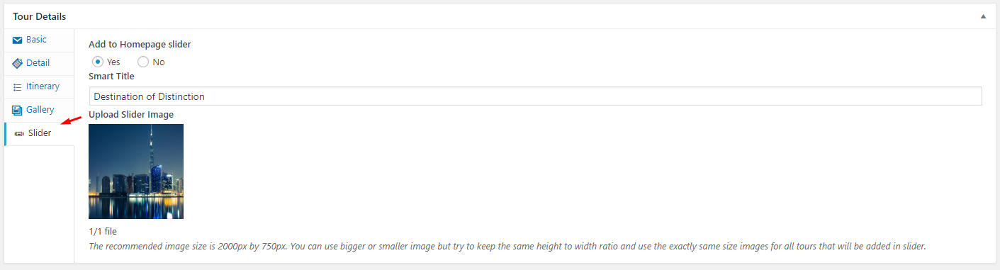
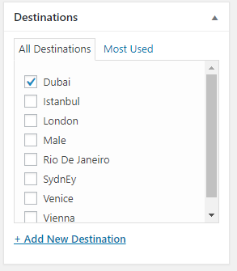
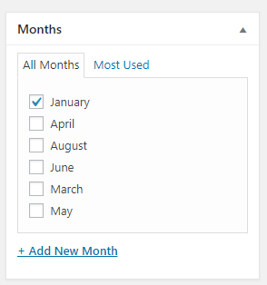

### **Add Tour Title**

### **Add Tour Description**

### **Add Basic Information**

Add basic information related to tour, Like Price, Discounted Price, Days, Departure, Meal etc.

### **Provide Location on Google Map**

Provide tour address and drag the google map pointer to correct location.

### **Tour Offers Included**

Add tour offers and features which are included or not.

### **Tour Itinerary**

Add tour Itinerary, visits and places.

### **Add Gallery Images**

Provide tour gallery images.

!!! warning ""
    It is recommended to upload bigger images like **1200px by 800px** or even bigger.

### **Add Banner**

Provide tour banner details.

!!! warning ""
    The recommended banner image size is **1600px by 600px**. Tour featured image will be displayed if no banner is provided..

### **Add Tour To Homepage Slider**

If you want to add tour to homepage slider then you have to provide the details shown in below screenshot

!!! warning ""
    The recommended image size is **2000px by 750px**. You can use bigger or smaller image but try to keep the same height to width ratio and use the exactly same size images for all tours that will be added in slider.

### **Add Featured Image**

Provide tour featured image (it is a must )

!!! warning ""
    Minimum required image size is **720px by 560px**.

### **Add/Assign Tour Destinations**

You can choose or add tour destinations from related meta box displayed in screen shot below.

### **Add/Assign Tour Types**

You can choose or add tour types from related meta box displayed in screen shot below.

### **Add/Assign Tour Months**

You can choose or add tour months from related meta box displayed in screen shot below.

**Publish the tour post once it is ready.**