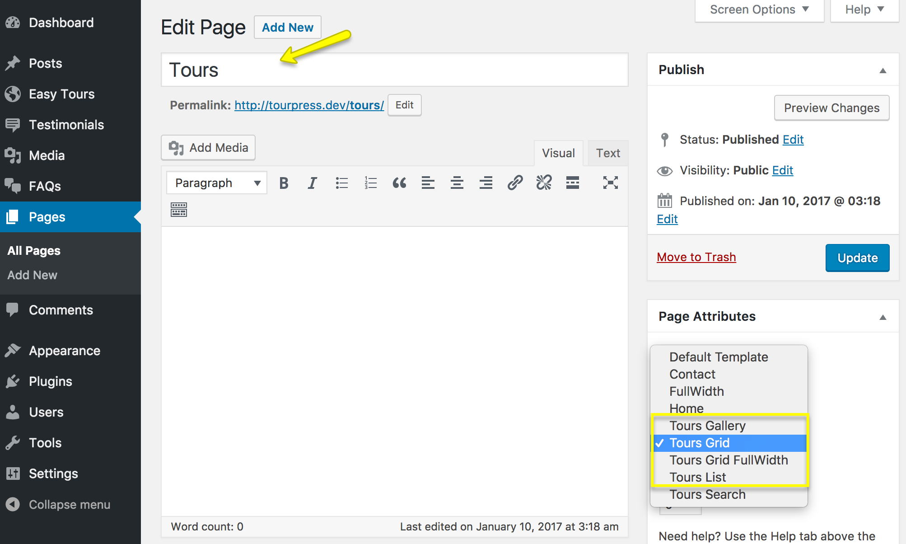
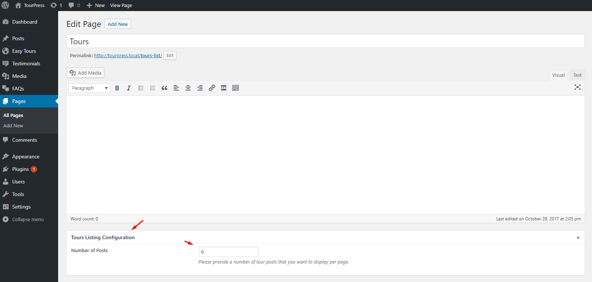

Go to **Dashboard &rarr; Pages &rarr; Add New**

* Provide page title **Tours List**.
* Choose appropriate page template.

There are 4 templates for tours pages.

  1. **Tours Gallery**
  2. **Tours Grid**
  3. **Tours Grid FullWidth**
  4. **Tours List**

Publish the page once it is ready.

If you want to set number of tours on tour page then go to **Dashboard &rarr; Pages &rarr; Tours List** and look for **Tours Listing Configuration** section as shown below

Choose how many tours you want to display on page and publish/update it.

After publishing you need to add the newly created page in menu from **Dashboard &rarr; Appearance &rarr; Menus**

