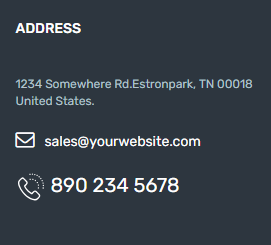

Go to **Dashboard > Appearance > Widgets** and look for Inspiry - Address & Contacts widget.

Use that widget in a sidebar and provide its title, address, email and phone.

Now check out the front end of your site and you will have the Address & Cotacts widget working.

