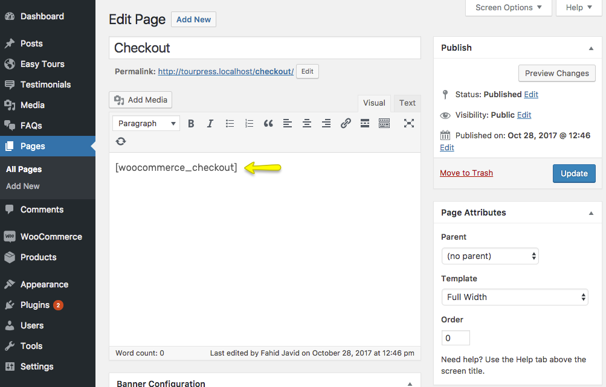
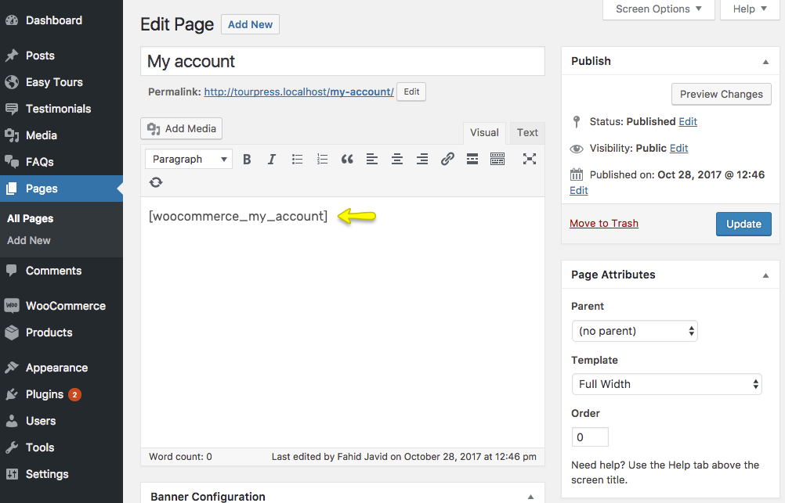
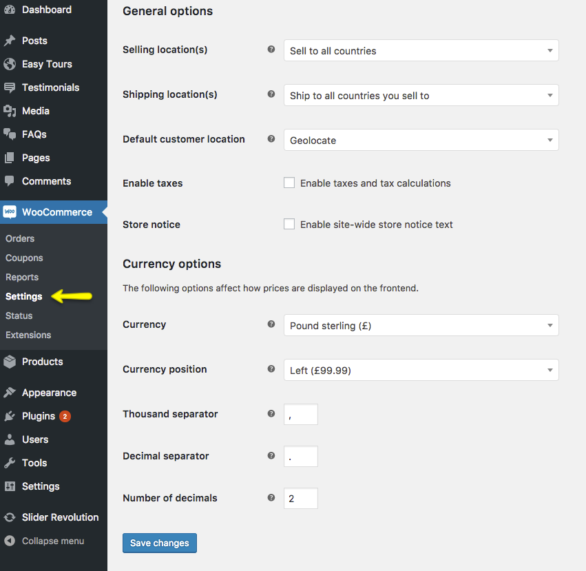

!!! tip ""
    If you have imported demo contents using **One Click Demo** OR **Import XML** method then pages and product will be created automatically. You just need to configure settings.

To setup WooCommerce Shop, you need to install [WooCommerce](https://wordpress.org/plugins/woocommerce/) plugin on your site.

## Installing WooCommerce Plugin ##

Go to the **Appearance &rarr; Plugins &rarr; Add New** page and search for the *WooCommerce* as guided in the following screenshot.

 

Click on *Install Now* button and then *Activate* the plugin.

## WooCommerce Store Setup ##

Once you clicked the plugin *Activate* button it will take you to the WooCommerce Store Setup page, where you can complete your store setup in steps. See this helping screenshot.

 
 
## Import Products & Shop Pages ##
 
After WooCommerce Store Setup completion you can import your Products from your older site via CSV file by clicking on the *Import products* button.

 
 
Once you clicked the *Import products* button, it will redirect you to the products import page.

 
 
## Create Shop Pages ##

!!! info ""
    If you have followed above store setup procedure or you have imported the Shop pages with Products already then you do not need to create them again.
    
### Shop Page ###
You can give a title **Shop** to this page and select **Default Template** then click the **Publish** button.

 
 
### Cart Page ###
You can give a title **Cart** to this page and select **Full Width** template. Add *[woocommerce_cart]* shortcode to the content area then click the **Publish** button.

 
 
### Checkout Page ###
You can give a title **Checkout** to this page and select **Full Width** template. Add *[woocommerce_checkout]* shortcode to the content area then click the **Publish** button.

### My Account Page ###
You can give a title **My account** to this page and select **Full Width** template. Add *[woocommerce_my_account]* shortcode to the content area then click the **Publish** button.

 
 
## WooCommerce Settings ##
You can update WooCommerce Settings from **WooCommerce &rarr; Settings** page and its tabs. 
 
 
 
 1. **Configure Shop Page**
    
    Go to the **Products &rarr; Display** tab and select *Shop* page for *Shop page* option as displayed in the following screenshot.
    
    
    
 1. **Configure Cart & Checkout Pages**
    
    Go to the **Checkout &rarr; Checkout options** tab and select *Cart* and *Checkout* pages accordingly.
        
    
    
 1. **My Account Page**
    
    Go to the **Accounts** tab and select *My account* page for the *My account page* option.
            
    

!!! tip ""
    If above guide is not enough for you to setup your shop. Then you can consult WooCommerce plugin's extensive documentation or detailed video tutorials on the following links.
    
    [Getting Started Documentation](https://docs.woocommerce.com/documentation/plugins/woocommerce/getting-started/) | 
    [Getting Started Video Tutorials](https://docs.woocommerce.com/document/woocommerce-guided-tour-videos/)
